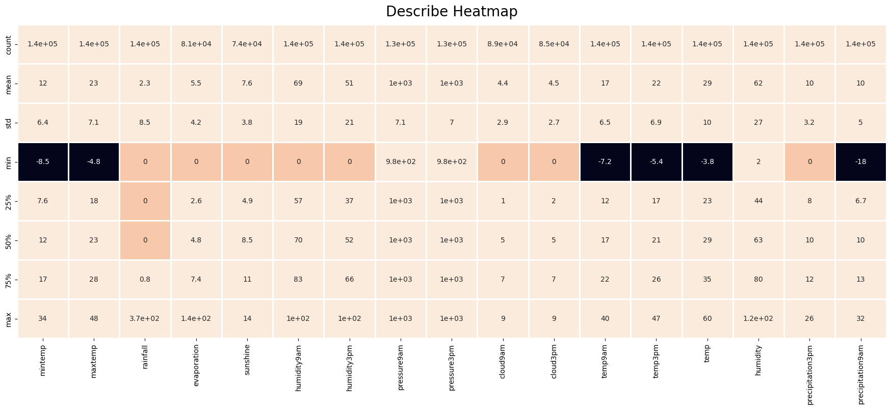

# Predicting rain in Australia with Machine Learning

Project status: In Progress

<p align="center"></p>

# Project Summary

Given that it rains today, will it rain again tomorrow?
Real-time accurate rainfall prediction is challenging due to the inherent non-linear nature of weather. Using a database of meteorological variables in different cities of
Australia, the goal of this project is to train a model on short-term rainfall prediction (forecasting range up to 72 hours).

---

# Technologies

- Python 3.8.13
	- Pandas 1.4.4
	- Numpy 1.21.5
	- Pycaret 2.3.10
	- Seaborn 0.11.2
	- Matplotlib 3.5.2
	- Scikit-learn 1.1
	- TensorFlow 2.11.0

---

## Data Description

- This dataset is also utilized in a case for the position of Data Scientist in a Brazilian bank.
- The data is organized in two sets:
	- `rain_data_aus.csv`: Contains most of the information for all stations.
	- `wind_table_01.csv to wind_table_08.csv`: Contains additional information on wind speed and direction.

- The sets are separated since they originate from different systems of meteorological instrumentation..

Variable | Description
---------|------------
Date   |  The date of observation
Location   |  The common name of the location of the weather station
MinTemp   |  The minimum temperature in degrees celsius
MaxTemp   |  The maximum temperature in degrees celsius
Rainfall   |  The amount of rainfall recorded for the day in mm
Evaporation   |  The so-called Class A pan evaporation (mm) in the 24 hours to 9am
Sunshine   |  The number of hours of bright sunshine in the day.
WindGustDir   |  The direction of the strongest wind gust in the 24 hours to midnight
WindGustSpeed   |  The speed (km/h) of the strongest wind gust in the 24 hours to midnight
WindDir9am   |  Direction of the wind at 9am
WindDir3pm   |  Direction of the wind at 3pm
WindSpeed9am   |  Wind speed (km/hr) averaged over 10 minutes prior to 9am
WindSpeed3pm   |  Wind speed (km/hr) averaged over 10 minutes prior to 3pm
Humidity9am   |  Humidity (percent) at 9am
Humidity3pm   |  Humidity (percent) at 3pm
Pressure9am   |  Atmospheric pressure (hpa) reduced to mean sea level at 9am
Pressure3pm   |  Atmospheric pressure (hpa) reduced to mean sea level at 3pm
Cloud9am   |  Fraction of sky obscured by cloud at 9am. This is measured in "oktas", which are a unit of eigths. It records how many eigths of the sky are obscured by cloud. A 0 measure indicates completely clear sky whilst an 8 indicates that it is completely overcast.
Cloud3pm | Fraction of sky obscured by cloud (in "oktas": eighths) at 3pm. See Cload9am for a description of the values
Temp9am |  Temperature (degrees C) at 9am
Temp3pm |  Temperature (degrees C) at 3pm
Precipitation9am |  The amount of rain in mm prior to 9am
Precipitation3pm |  The amount of rain in mm prior to 3pm
AmountOfRain |  The amount of rain in mm
Temp |  Temperature (degrees C)
Humidity |  Humidity (percent)
RainToday |  Boolean: 1 if precipitation (mm) in the 24 hours to 9am exceeds 1mm, otherwise 0
RainTomorrow |  **The target variable. Will it rain tomorrow?**

---
## Data Inspection and Pre-processing: Rain data

**Snapshot**
|   |       date | location | mintemp | maxtemp | rainfall | evaporation | sunshine | humidity9am | humidity3pm | pressure9am | pressure3pm | cloud9am | cloud3pm | temp9am | temp3pm | raintoday | amountOfRain | raintomorrow |  temp |  humidity | precipitation3pm | precipitation9am | modelo_vigente |
|---|-----------:|---------:|--------:|--------:|---------:|------------:|---------:|------------:|------------:|------------:|------------:|---------:|---------:|--------:|--------:|----------:|-------------:|-------------:|------:|----------:|-----------------:|-----------------:|---------------:|
| 0 | 2008-12-01 |   Albury |    13.4 |    22.9 |      0.6 |         NaN |      NaN |        71.0 |        22.0 |      1007.7 |      1007.1 |      8.0 |      NaN |    16.9 |    21.8 |        No |          0.0 |           No | 29.48 | 28.400000 |               12 |         5.115360 |       0.089825 |
| 1 | 2008-12-02 |   Albury |     7.4 |    25.1 |      0.0 |         NaN |      NaN |        44.0 |        25.0 |      1010.6 |      1007.8 |      NaN |      NaN |    17.2 |    24.3 |        No |          0.0 |           No | 32.12 |  2.208569 |               10 |        21.497100 |       0.023477 |
| 2 | 2008-12-03 |   Albury |    12.9 |    25.7 |      0.0 |         NaN |      NaN |        38.0 |        30.0 |      1007.6 |      1008.7 |      NaN |      2.0 |    21.0 |    23.2 |        No |          0.0 |           No | 32.84 | 38.000000 |               17 |        20.782859 |       0.027580 |
| 3 | 2008-12-04 |   Albury |     9.2 |    28.0 |      0.0 |         NaN |      NaN |        45.0 |        16.0 |      1017.6 |      1012.8 |      NaN |      NaN |    18.1 |    26.5 |        No |          1.0 |           No | 35.60 | 21.200000 |                8 |        12.028646 |       0.023962 |
| 4 | 2008-12-05 |   Albury |    17.5 |    32.3 |      1.0 |         NaN |      NaN |        82.0 |        33.0 |      1010.8 |      1006.0 |      7.0 |      8.0 |    17.8 |    29.7 |        No |          0.2 |           No | 40.76 | 41.600000 |                9 |        11.883546 |       0.220164 |

**insights**
- shape: 142193 rows × 21 columns
- _raintoday_ is either Yes or No, based on _rainfall_. Yes if _rainfall_ > 1.0, NO if _rainfall_ < 1.0
- _amountOfRain is the variable _rainfall_ with a 1-day lag. This column will be dropped to avoid data leaking.
- _modelo-vigente_ is an artificial column left in the case without further explanations. Will also be dropped (but let's keep an eye on it).
- _date_ is an object. Convert to datetime.
- No duplicates here.
- Several NaNs in several columns. Investigate.

<p align="center"></p>

- pd.describe is always an useful tool to get an initial bird-eye view of the dataset:

|       |       mintemp |       maxtemp |      rainfall |  evaporation |     sunshine |   humidity9am |   humidity3pm |   pressure9am |   pressure3pm |     cloud9am |     cloud3pm |       temp9am |       temp3pm |          temp |      humidity | precipitation3pm | precipitation9am |
|-------|--------------:|--------------:|--------------:|-------------:|-------------:|--------------:|--------------:|--------------:|--------------:|-------------:|-------------:|--------------:|--------------:|--------------:|--------------:|-----------------:|-----------------:|
| count | 141556.000000 | 141871.000000 | 140787.000000 | 81350.000000 | 74377.000000 | 140419.000000 | 138583.000000 | 128179.000000 | 128212.000000 | 88536.000000 | 85099.000000 | 141289.000000 | 139467.000000 | 141871.000000 | 138583.000000 |    142193.000000 |    142193.000000 |
|  mean |     12.186400 |     23.226784 |      2.349974 |     5.469824 |     7.624853 |     68.843810 |     51.482606 |   1017.653758 |   1015.258204 |     4.437189 |     4.503167 |     16.987509 |     21.687235 |     28.505419 |     61.991179 |        10.014164 |        10.000748 |
|   std |      6.403283 |      7.117618 |      8.465173 |     4.188537 |     3.781525 |     19.051293 |     20.797772 |      7.105476 |      7.036677 |     2.887016 |     2.720633 |      6.492838 |      6.937594 |     10.237506 |     26.649111 |         3.169832 |         4.997908 |
|   min |     -8.500000 |     -4.800000 |      0.000000 |     0.000000 |     0.000000 |      0.000000 |      0.000000 |    980.500000 |    977.100000 |     0.000000 |     0.000000 |     -7.200000 |     -5.400000 |     -3.760000 |      2.000000 |         0.000000 |       -17.739346 |
|   25% |      7.600000 |     17.900000 |      0.000000 |     2.600000 |     4.900000 |     57.000000 |     37.000000 |   1012.900000 |   1010.400000 |     1.000000 |     2.000000 |     12.300000 |     16.600000 |     22.520000 |     44.000000 |         8.000000 |         6.650238 |
|   50% |     12.000000 |     22.600000 |      0.000000 |     4.800000 |     8.500000 |     70.000000 |     52.000000 |   1017.600000 |   1015.200000 |     5.000000 |     5.000000 |     16.700000 |     21.100000 |     28.520000 |     63.200000 |        10.000000 |        10.000009 |
|   75% |     16.800000 |     28.200000 |      0.800000 |     7.400000 |    10.600000 |     83.000000 |     66.000000 |   1022.400000 |   1020.000000 |     7.000000 |     7.000000 |     21.600000 |     26.400000 |     35.480000 |     80.000000 |        12.000000 |        13.389306 |
|   max |     33.900000 |     48.100000 |    371.000000 |   145.000000 |    14.500000 |    100.000000 |    100.000000 |   1041.000000 |   1039.600000 |     9.000000 |     9.000000 |     40.200000 |     46.700000 |     59.720000 |    122.000000 |        26.000000 |        32.478590 |

- I find that a "describe heatmap" is also useful to catch discrepancies in the data.

<p align="center"></p>

**Additional info**

- rain_new['location'].unique().size yields 49 unique locations (cities).
- rain_new['location'].value_counts() shows that the input for each city is not equal. Some cities (e.g. Canberra, Sydney, Perth) have over 3.000 data points, while others
(e.g. Nhil, Katherine, Uluru) have less than 1.600 data points.
- rain_new['date'].unique() yields 3436 distinct dates. The dataset ranges from '2007-11-01' to '2017-06-25', about 9 years and a half of data.
- some preprocessing fits here: Yes and No to 1s and 0s respectively (the model appreciates!)

```
rain_new.loc[rain_new['raintoday'] == 'No','raintoday'] = 0
rain_new.loc[rain_new['raintoday'] == 'Yes','raintoday'] = 1

rain_new.loc[rain_new['raintomorrow'] == 'No','raintomorrow'] = 0
rain_new.loc[rain_new['raintomorrow'] == 'Yes','raintomorrow'] = 1
```

- Finally, our dataset shape is now 142193 rows × 21 columns

---

## Data Inspection: Wind data 1-8

Other than the rain data, we are also given 8 separate csv files with wind data. Let's import, concatenate, inspect and pre-process it

```
wind = pd.DataFrame()
for i in range(1, 9):
    df_ = pd.read_csv(f'data/wind_table_0{i}.csv')
    df_.columns = [col.replace("_", "") for col in df_.columns] # Column headers are different in some files. This line fixes the issue!
    wind = pd.concat([wind, df_])
    print(wind.shape)
print(wind.shape)
wind.head()
```

**Snapshot**
|   |       date | location | windgustdir | windgustspeed | winddir9am | winddir3pm | windspeed9am | windspeed3pm |
|--:|-----------:|---------:|------------:|--------------:|-----------:|-----------:|-------------:|-------------:|
| 0 | 2007-11-01 | Canberra |          NW |          30.0 |         SW |         NW |          6.0 |         20.0 |
| 1 | 2007-11-02 | Canberra |         ENE |          39.0 |          E |          W |          4.0 |         17.0 |
| 2 | 2007-11-03 | Canberra |          NW |          85.0 |          N |        NNE |          6.0 |          6.0 |
| 3 | 2007-11-04 | Canberra |          NW |          54.0 |        WNW |          W |         30.0 |         24.0 |
| 4 | 2007-11-05 | Canberra |         SSE |          50.0 |        SSE |        ESE |         20.0 |         28.0 |

**Insights**

- shape: (164386, 8)
- date is also object here. Convert to datetime.
- several NaNs in several columns.
- wind[wind.duplicated()] yields a bunch of duplicates! Lets deal with them: wind=wind.drop_duplicates().reset_index(drop=True)
- After dropping duplicates, shape is (142193, 8), same number of rows as the rain dataset!

<p align="center"></p>

---

## Merging both datasets on date and location:

```
wind_rain =pd.merge(rain_new,wind,on=['date','location'],how ='left')
```

- New shape is (142193, 27).
- Final view of NaNs:

<p align="center"></p>

There is some additional pre-processing that can be performed here:

- Currently, our merged dataset has a shape of 142.193 rows x 27 columns. It can be trimmed a little bit more.
- `date` is a particularly useful attribute, especially considering that we have about 10 years of data. Embedded in this temporal series is the climate variability in scales
ranging from sazonal to inter-annual (and even a parcel of the so called long-term effect due to accelerated heating in the 21st century). The effects of seasons and
large-scale temporal phenomena such as the ENSO are all modulating the weather described in the dataset. That being said, the "date" atribute per se will not affect the model,
so for now we can hide it.

```
wrc.drop('date', axis=1, inplace=True)
```

**what should be done with the NaNs?**

- For numerical attributes, there are straightforward options e.g. interpolation, or even dropping them altogether for a baseline.
- Categorical attributes requires some creativity.

We know that the NaNs in raintoday are < 1% of the total length, so I'm tempted to drop these NaNs. This column is, after all, one of our most precious predictors. Some colleagues sugested converting all NaNs to "No". I think that will unnecessarily polute our database. On the other hand, we are dropping over 1000 datapoints..

`wrc = wrc[wrc['raintoday'].notna()]` drops us from 142193 to 140787.

- raintoday and raintomorrow are clean, and are already encoded as 0s and 1s. I guess we could have used a label encoder e.g.

```
# from sklearn.preprocessing import LabelEncoder
# encoder = LabelEncoder()
# label_encoder_columns = ['RainToday', 'RainTomorrow']
# for column in label_encoder_columns:
#   data[column] = encoder.fit_transform(data[column])
```

Location is still an object. Our model won't like that a whole lot, so what can we do?

    ... How about onehotencoding? It's good for those attributes without any particular order, BUT... We will run into an issue. Both winddir9am and winddir3pm have the same label (e.g. NE), so onehotencoding will create duplicate values, which is awful. To fix this, we will need to add a prefix to differentiate between them.

```
def add_column_prefixes(data, column, prefix):
    return data[column].apply(lambda x: prefix + str(x)) # return that specific column that we will apply "take x (value of the column" and add the prefix to it"
```

Now we apply:

```
wrc['winddir9am'] = add_column_prefixes(wrc,'winddir9am', '9am_')
wrc['winddir3pm'] = add_column_prefixes(wrc,'winddir3pm', '3pm_')
```

This also solves the issue with `windgustdir` as it has become unique now:

|     | winddir9am | winddir3pm | windgustdir |
|----:|-----------:|-----------:|------------:|
|   0 |      9am_W |    3pm_WNW |           W |
|   1 |    9am_NNW |    3pm_WSW |         WNW |
|   2 |      9am_W |    3pm_WSW |         WSW |
|   3 |     9am_SE |      3pm_E |          NE |
|   4 |    9am_ENE |     3pm_NW |           W |
| ... |        ... |        ... |         ... 

`pd.get_dummies(wrc['windgustdir'])` will onehotencode this particular variabl
- every unique value has been assigned a column of its own, as such:

|   | E | ENE | ESE | N | NE | NNE | NNW | NW | S | SE | SSE | SSW | SW | W | WNW | WSW |
|--:|--:|----:|----:|--:|---:|----:|----:|---:|--:|---:|----:|----:|---:|--:|----:|----:|
| 0 | 0 |   0 |   0 | 0 |  0 |   0 |   0 |  0 | 0 |  0 |   0 |   0 |  0 | 1 |   0 |   0 |
| 1 | 0 |   0 |   0 | 0 |  0 |   0 |   0 |  0 | 0 |  0 |   0 |   0 |  0 | 0 |   1 |   0 |
| 2 | 0 |   0 |   0 | 0 |  0 |   0 |   0 |  0 | 0 |  0 |   0 |   0 |  0 | 0 |   0 |   1 |
| 3 | 0 |   0 |   0 | 0 |  1 |   0 |   0 |  0 | 0 |  0 |   0 |   0 |  0 | 0 |   0 |   0 |
| 4 | 0 |   0 |   0 | 0 |  0 |   0 |   0 |  0 | 0 |  0 |   0 |   0 |  0 | 1 |   0 |   0 | 

- But most importantly, whenever there is a NaN in a row, every dummy is assigned a zero.
- Now we will create a function that will apply the dummies matrix for each of our categorical features that need onehotencoding

```
def onehot_encoder(data,columns):
    for column in columns:
        dummies = pd.get_dummies(data[column])
        data = pd.concat([data,dummies],axis=1) # this will _really_ increase our number of columns, but that should be fine
        data.drop(column,axis=1,inplace=True) # remove the original column from which we got the encodings.
    return data
```

After which our 4 categorical variables are gone and have been replaced with their respective dummies! This will really help our model run.

- We must now deal with the NaNs from the numerical attributes.
- One of the options in this case is to compute the mean in each column and set all the null values in that column to be the mean of that column.

```
def apply_means(data,columns):
    for column in columns:
        data[column] = data[column].fillna(data[column].mean())
```

- I suppose this can deal with our null values without altering the variance of the feature too much.
- After applying, `wrc3.isnull().sum().sum()` shows not a single NaN left!
- Our final, cleaned and processed dataset is ready to be ingested by the model. Final shape: (140787, 121)
---

**our dataset is ready, but let's take a step back to look at the relationships between variables**

<p align="center"></p>

---

<p align="center"></p>

From the correlation matrix shown above, we can determine a desire cutoff point for highly correlated variable. Variables that are highly correlated with
each other will have the same effect on the target variable. Hence, all the highly correlated variables are suggested to be removed from the analysis. The usual suspects
are the pairs Temp9am/Temp3pm, Pressure9am/Pressure3pm, Humidity9am/Humidity3pm and cloud9am/cloud3pm. However, instead of removing one of the attributes in each pair, new variables will be created to
preserve the full meaning of the variables, defined as an arithmetic mean between the pairs.

---

Analyzing the distribution of numerical variables:

```
f = pd.melt(df, value_vars=df.select_dtypes(include=[np.number]).columns) #create a gigantic list of sequential values ordered by variable (mintemp, maxtemp, rainfall, etc)
g = sns.FacetGrid(f, col="variable",  col_wrap=2, sharex=False, sharey=False) #create a grid for each variable
g = g.map(sns.distplot, "value") #overlay a distplot on top of it
```
<p align="center"></p>

**Insights**

- Many variables displaying high normality: temperature, humidity and pressure, as expected.
- Why is precipitation3pm so different from precipitation9am? It looks more reasonable in the morning. Inspect the data.
- Wind data is more finicky.

---

# Predictive Model

- Now we are ready to scale and train our model. Both were done with SKLearn at this step.

```
y = wrc3['raintomorrow'] # our target variable
X = wrc3.drop(['raintomorrow'],axis=1) # everything except our target variable
```

OBS - `y.value_counts()` tells us that 22.16% of days had rain

RobustScaler:
```
# Scale X using the RobustScaler (since the variables have so many different ranges)
scaler = RobustScaler()

X = pd.DataFrame(scaler.fit_transform(X),columns=X.columns) #scaler.fit_transform(x) will return a numpy array, so we put it back into a dataframe (easier to visualize)
```


