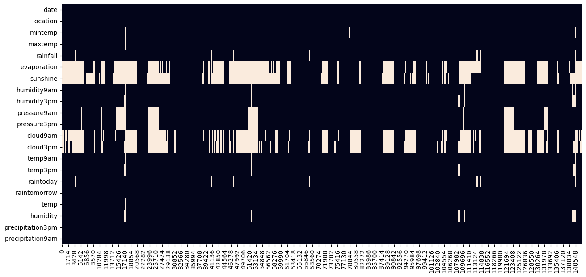
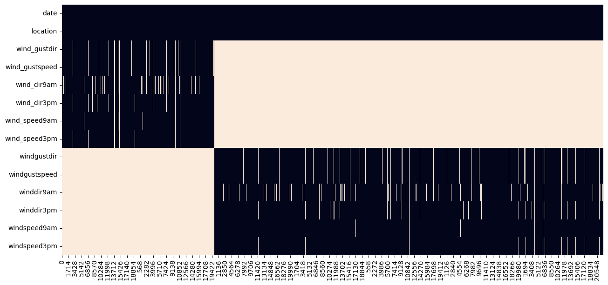
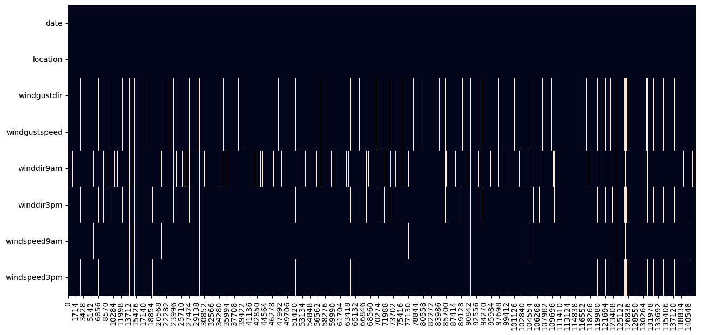
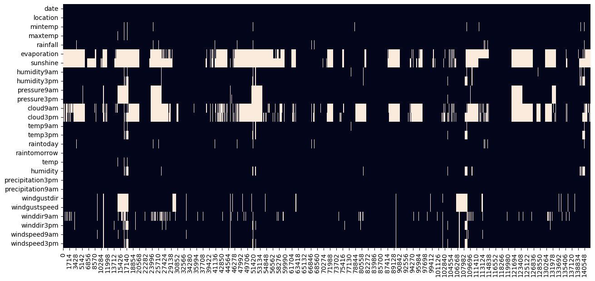
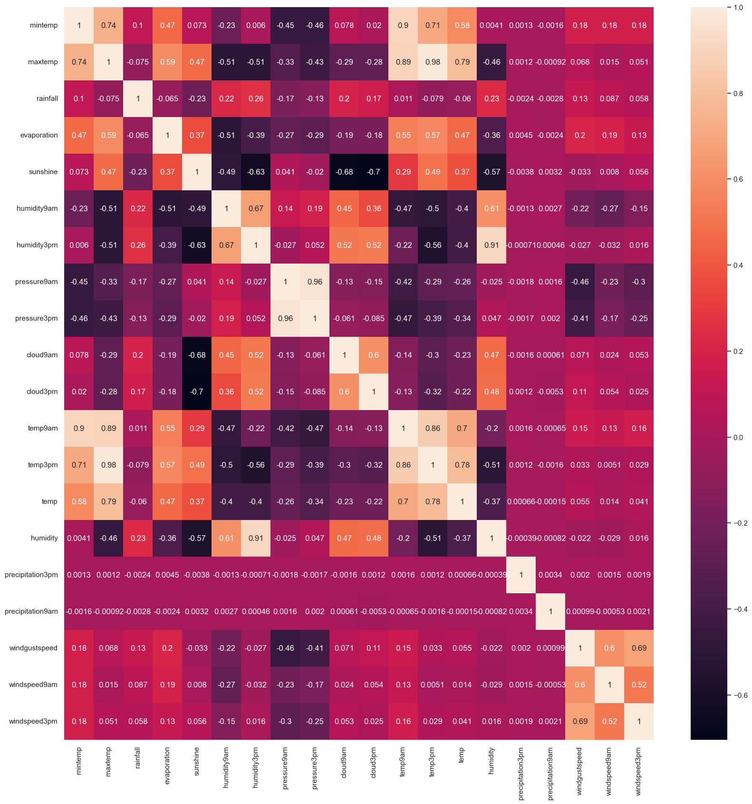

## Descrição

Project status: In Progress

# Project Summary

---

# Technologies

- Python 3.8.13
	- Pandas 1.4.4
	- Numpy 1.21.5
	- Pycaret 2.3.10
	- Seaborn 0.11.2
	- Matplotlib 3.5.2
	- Scikit-learn 1.1
	- Seaborn 0.11.2
- Tableau 2022.3

---

## The Case

Este case consiste em um exercício prático de construção de um modelo e quais insights você consegue extrair dos dados.

Desenhamos o case para que você possa mostrar as suas habilidades como cientista de dados.

O conjunto de dados que fornecemos contém observações diárias do clima de algumas estações meteorológicas na Austrália.
 
Os dados estão organizados em duas tabelas:

- `rain_data_aus.csv`: Contém a maior parte das informações, já centralizadas, de todas as estações.

- `wind_table_01.csv a wind_table_08.csv`: Contém informações sobre velocidade e orientação de ventos.

As tabelas estão apartadas, pois são originadas de um outro instrumento e salvas em um sistema apartado.

Submeta os arquivos em um repositório no git e nos envie o link para avaliação.

Idealmente, queremos poder replicar sua análise a partir dos códigos enviados. Portanto, especifique as versões das ferramentas e pacotes que você está usando.

---

## Objetivo:

Construir um modelo preditivo para determinar se vai ou não chover amanhã. 

---

## Data Description

Variable | Description
---------|------------
Date   |  The date of observation
Location   |  The common name of the location of the weather station
MinTemp   |  The minimum temperature in degrees celsius
MaxTemp   |  The maximum temperature in degrees celsius
Rainfall   |  The amount of rainfall recorded for the day in mm
Evaporation   |  The so-called Class A pan evaporation (mm) in the 24 hours to 9am
Sunshine   |  The number of hours of bright sunshine in the day.
WindGustDir   |  The direction of the strongest wind gust in the 24 hours to midnight
WindGustSpeed   |  The speed (km/h) of the strongest wind gust in the 24 hours to midnight
WindDir9am   |  Direction of the wind at 9am
WindDir3pm   |  Direction of the wind at 3pm
WindSpeed9am   |  Wind speed (km/hr) averaged over 10 minutes prior to 9am
WindSpeed3pm   |  Wind speed (km/hr) averaged over 10 minutes prior to 3pm
Humidity9am   |  Humidity (percent) at 9am
Humidity3pm   |  Humidity (percent) at 3pm
Pressure9am   |  Atmospheric pressure (hpa) reduced to mean sea level at 9am
Pressure3pm   |  Atmospheric pressure (hpa) reduced to mean sea level at 3pm
Cloud9am   |  Fraction of sky obscured by cloud at 9am. This is measured in "oktas", which are a unit of eigths. It records how many eigths of the sky are obscured by cloud. A 0 measure indicates completely clear sky whilst an 8 indicates that it is completely overcast.
Cloud3pm | Fraction of sky obscured by cloud (in "oktas": eighths) at 3pm. See Cload9am for a description of the values
Temp9am |  Temperature (degrees C) at 9am
Temp3pm |  Temperature (degrees C) at 3pm
Precipitation9am |  The amount of rain in mm prior to 9am
Precipitation3pm |  The amount of rain in mm prior to 3pm
AmountOfRain |  The amount of rain in mm
Temp |  Temperature (degrees C)
Humidity |  Humidity (percent)
RainToday |  Boolean: 1 if precipitation (mm) in the 24 hours to 9am exceeds 1mm, otherwise 0
RainTomorrow |  The target variable. Did it rain tomorrow?

---

---

---

---

---

---

---

